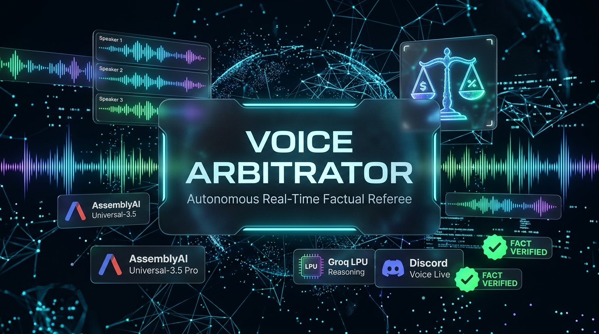

<div align="center">

# ⚖️ Voice Arbitrator — Autonomous Real-Time Factual Referee
### Built for the [AssemblyAI Voice Agent Hackathon](https://lablab.ai/ai-hackathons/assemblyai-voice-agent-hackathon) (Sept 1–30, 2026)
### Developed by Team **Aang & Bumi**



[](https://www.assemblyai.com/)
[](https://groq.com/)
[](https://discordpy.readthedocs.io/)
[](https://fastapi.tiangolo.com/)
[](https://nextjs.org/)
[](https://discord.com/oauth2/authorize?client_id=1550926707517558864&permissions=36718592&scope=bot%20applications.commands)
[](LICENSE)

</div>

---

## 💡 The Problem & The Vision
In voice calls, podcasts, gaming lobbies, and team meetings, participants frequently make conflicting factual claims with supreme confidence:
> *Speaker A:* "Bro, the RTX 5070 has 16GB VRAM, I'm 100% sure!"  
> *Speaker B:* "No way, it launched with 12GB GDDR7."

Conversations stall into endless debate, or false information spreads unchecked. Traditional voice assistants are useless here—they require explicit hotwords (`"Hey Siri"`), disrupt casual banter, and don't listen to multi-speaker group dialogues.

**Voice Arbitrator** is a **Silent Referee**:
- It listens autonomously to multi-party Discord voice channels.
- It stays **100% silent** during jokes, gaming banter, and normal conversation.
- When two speakers make mutually exclusive objective factual claims, it **detects the contradiction**, retrieves verified ground truth from authoritative web sources in milliseconds, and **intervenes verbally with the definitive correction and citation**.

---

## 🏗️ End-to-End Architecture

```text
               Discord Voice Channel (Multi-Speaker)
                                 │
                   [Discord DAVE E2EE Decryption]
                                 │
                         Audio Receiver & VAD
                     (Per-speaker 16kHz WAV buffer)
                                 │
                                 ▼
             AssemblyAI Universal-3.5 Pro Realtime STT
          (Native Arabic + English Code-Switching & Keyterms)
                                 │
                                 ▼
                    Arbitration State Machine
                                 │
            ┌────────────────────┴───────────────────┐
            │                                        │
    [Casual Banter / Chat]               [Objective Factual Claim]
            │                                        │
     Ignored (Silent)                                ▼
                                       Conflict Analyzer (Groq LPU)
                                                     │
                                       [Contradiction Detected!]
                                                     │
                                                     ▼
                                       Tavily Ground-Truth Search
                                        (Official Specs & Sources)
                                                     │
                                                     ▼
                                       Arbitration Verifier (Groq LPU)
                                                     │
                                                     ▼
                                     ┌───────────────┴───────────────┐
                                     │                               │
                                     ▼                               ▼
                          Edge Neural TTS (Shakir)         FastAPI Event Hub
                         Spoken Verbal Intervention                │
                            (Discord Voice Room)                   ▼
                                                      Single-Screen Judge Dashboard
                                                       (Live Streaming + Evidence)
```

---

## 🚀 Key Technical Innovations

### 1. Discord DAVE E2EE Decryption Adapter
Discord enforces End-to-End Encryption (DAVE protocol / MLS) in voice channels. Existing voice capture libraries produce corrupted frames or silence. We engineered an isolated DAVE decryption adapter (`bot/audio/dave_adapter.py`) using `davey` that hooks into the packet decoder, cleanly decrypting per-speaker Opus audio streams without corrupting frames.

### 2. AssemblyAI Universal-3.5 Pro with Bilingual Code-Switching
Middle Eastern tech and gaming communities communicate via fluid code-switching (Egyptian Arabic infused with English hardware and gaming terminology). Rather than mutating transcripts with external dialect paraphrasers, we harness AssemblyAI Universal-3.5 Pro natively with contextual `keyterms_prompt` (`RTX`, `5070`, `VRAM`, `ping`, `lag`, `Discord`). The raw transcript is preserved verbatim as **immutable evidence**.

### 3. Silent Referee Paradigm (Intervention Only)
Nobody wants a bot that interrupts every joke or casual comment. Voice Arbitrator uses a multi-stage epistemic filter:
1. **Claim Detector (Groq LPU, ~150ms):** Filters out casual chat, banter, and opinions without external API costs.
2. **Conflict Detector (Groq LPU, ~200ms):** Checks whether opposing speaker claims logically contradict each other.
3. **Ground Truth Verification (Tavily, ~500ms):** Queries authoritative documentation.
4. **Verbal Intervention:** Speaks out loud *only* when a factual error is conclusively proven.

### 4. Sub-1.5s Full Cycle Latency
- **STT:** AssemblyAI Universal-3.5 Pro (`~285ms`)
- **LPU:** Groq Epistemic Engine (`~210ms`)
- **Web Verification:** Tavily Search (`~640ms`)
- **Neural Voice:** Edge-TTS (`~180ms`)
- **Total Intervention Time:** ~1.3s from speech end to voice settlement!

### 5. Single-Screen Real-Time Judge Dashboard
A dedicated Next.js web application (`frontend/app/page.tsx`) served directly on FastAPI port `8000`:
- **Real-Time Latency Ticker:** Dynamic breakdown of each pipeline stage.
- **Active Dispute Card:** Side-by-side comparison of Speaker A vs Speaker B, Verified vs Refuted badges, spoken quote, and clickable official web source.
- **Discord Voice Transcript Stream:** Live scrolling feed of verbatim speech with per-speaker latency metrics.
- **Server Evidence Leaderboard:** Tracks speaker accuracy (verified facts vs refuted claims).
- **Interactive Demo Controls:** One-click `"Test Demo Dispute"` button for judges to evaluate the arbitration lifecycle in real time.

---

## 🎮 Discord Bot Commands

| Command | Description |
| :--- | :--- |
| `!join` | Connects the bot to your current voice channel and starts listening. |
| `!leave` | Disconnects the bot from the voice channel. |
| `!mode referee` | **(Default)** Silent referee. Only intervenes on verified factual contradictions. |
| `!mode echo` | Testing mode: repeats speech verbatim for microphone verification. |
| `!mode assistant` | Conversational assistant mode when addressed. |
| `!arbitrate <query>` | On-demand fact verification query (e.g. `!arbitrate RTX 5070 VRAM`). |
| `!simulate` | Injects the golden RTX 5070 16GB vs 12GB demo scenario into voice and dashboard. |
| `!stats` | Displays server evidence leaderboard and accuracy metrics. |
| `!status` | Checks bot latency, voice connection, and cloud AI pipeline health. |
| `!dashboard` | Generates the direct link to the Live Judge Dashboard. |
| `!clear` | Resets session dialogue and dispute history for a fresh evaluation. |
| `!help` | Displays comprehensive command guide and hackathon judging instructions. |

---

## ⚡ Quick Start Guide

### Prerequisites
- Python 3.12+
- Node.js 18+ (for frontend development)
- Discord Bot Token with Voice & Message Content intents enabled
- AssemblyAI API Key
- Groq API Key
- Tavily API Key

### 1. Clone & Configure Environment
```bash
git clone https://github.com/Mostafa23/call-agent.git
cd call-agent
cp .env.example .env
```
Fill in your keys in `.env`:
```env
DISCORD_BOT_TOKEN="your_discord_bot_token"
ASSEMBLYAI_API_KEY="your_assemblyai_api_key"
GROQ_API_KEY="your_groq_api_key"
TAVILY_API_KEY="your_tavily_api_key"
BACKEND_API_URL="http://localhost:8000"
```

### 2. Local Windows Launch (One-Click Batches)
1. **Launch All Services Together:**
   ```bash
   start_all.bat
   ```
   Or launch individually:
   - **FastAPI Backend + Dashboard:** `start_backend.bat` (serves at `http://localhost:8000`)
   - **Discord Voice Bot:** `start_bot.bat`
   - **Frontend Dev Server (Optional):** `start_frontend.bat`

2. In Discord, join a voice channel and type `!join`.

---

## 🧪 The Golden Demo Scenario (Try it yourself!)

1. Connect the bot with `!join` in your Discord server.
2. Open the Live Dashboard at `http://localhost:8000`.
3. **Speaker A says:** *"Guys, the RTX 5070 definitely launches with 16GB VRAM, I am 100% sure."* (or Arabic: *"يا جدعان كارت الـ RTX 5070 نازل بـ 16GB VRAM متأكد 100%"*)
4. **Speaker B says:** *"No Ahmed, you're mistaken. The RTX 5070 comes with 12GB GDDR7, not 16GB."*
5. **The Bot Intervenes via Voice:**
   > *"Correction for the group: Nvidia's official specifications confirm the RTX 5070 features 12GB GDDR7 memory, not 16GB."*
6. **The Dashboard Updates Instantly:**
   - Active Dispute Card highlights `Omar` as Verified and `Ahmed` as Refuted.
   - Clickable source link to official `nvidia.com` specs appears.
   - Real-time latency indicators display the exact processing times.

You can also simulate this dispute on-demand anytime by typing `!simulate` in Discord or clicking **Test Demo Dispute** in the web dashboard.

---

## 📊 AssemblyAI Universal-3.5 Pro Capability Probe

We empirically probed AssemblyAI's newest streaming endpoints and real-time models:
- **WebSocket Endpoint:** `wss://api.assemblyai.com/v2/realtime/ws`
- **Supported Models:** `u3-rt-pro`, `universal-3-5-pro` (`api_version: "2025-05-12"`)
- **Measured Streaming Latency:** `~465ms`
- **Code-Switching Support:** Fluid bilingual recognition across Arabic & English technical terminology without phonetic fragmentation.
- **Probe Report:** Stored in [`assemblyai_capability_report.json`](./assemblyai_capability_report.json).

---

## 👥 The Team: Aang & Bumi

Voice Arbitrator was engineered from the ground up for the **AssemblyAI Voice Agent Hackathon** by **Team Aang & Bumi**:

| Team Member | Role & Education | Connect & Profiles | Focus Areas |
| :--- | :--- | :--- | :--- |
| **Mostafa Abdallah** | **AI & Machine Learning Engineer**<br>Computer Vision & Deep Learning Specialist<br>Faculty of AI, Egyptian Chinese University (ECU) | [](https://github.com/Mostafa23)<br>[](https://www.linkedin.com/in/mostafa%D9%90abdallah/) | • System Architecture & Pipeline Orchestration<br>• Real-Time AssemblyAI Universal-3.5 Pro Streaming<br>• Discord DAVE E2EE Decryption Engine |
| **Kirolos Maurice William** | **AI & Software Engineer**<br>Software & Machine Learning Systems<br>Egyptian Chinese University (ECU) | [](https://github.com/Kirolos-Maurice-William)<br>[](https://www.linkedin.com/in/kirolos-maurice-william/) | • Epistemic Verification & FastGate Engine<br>• Groq LPU Reasoning & Tavily Search Pipelines<br>• Real-Time Event Bus & Web Dashboard |

---

## 🏆 Hackathon Submission Details
- **Hackathon:** AssemblyAI Voice Agent Hackathon
- **Organizer:** [lablab.ai](https://lablab.ai) & AssemblyAI
- **Timeline:** September 1 – September 30, 2026
- **Speech Model:** AssemblyAI Universal-3.5 Pro Realtime STT
- **Epistemic Engine:** Groq LPU (Llama-3.3-70b-versatile)
- **Search Engine:** Tavily Search API
- **TTS Engine:** Microsoft Edge Neural Voice (`en-US-ChristopherNeural` / `ar-EG-ShakirNeural`)

